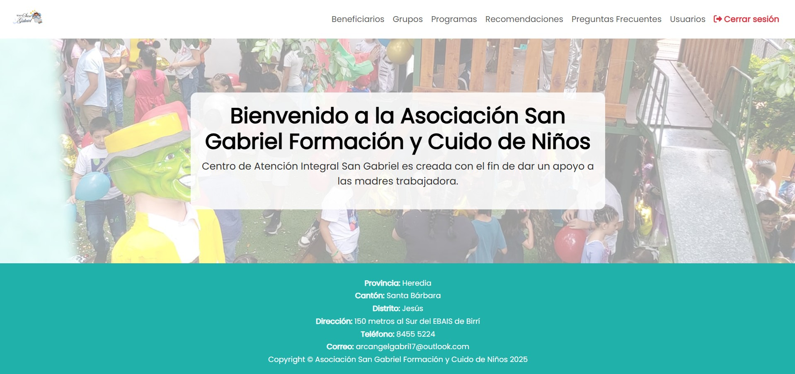

# 🏫 Asociación San Gabriel Formación y Cuido de Niños

This project has been developed as part of the University Community Work (TCU) at Fidélitas University. Its main goal is to implement a web application for the comprehensive management of information related to the population served by the San Gabriel Childcare and Training Association.

The project is based on the knowledge acquired in courses on Web Application Design and Development, Client-Server Web Environment, Advanced Programming, and Advanced Web Programming.

The application will allow administrative staff to manage users, beneficiaries, groups, and programs, in addition to providing a module for error logging and auditing, thus contributing to more efficient and organized administration.



## 🧩 Features

- 👥 **User Management**
    - 📝 Registration, editing, and deletion of users.
    - 🔐 Role-based access control (Administrator, Master).
    - 🔑 Login and secure authentication system.
    - 📧 Password recovery via email with unique verification token.
- 🧒🏻 **Beneficiary Management**
    - 🗂️ Registration and detailed profile management of beneficiaries.
    - 🧾 Assignment of beneficiaries to specific programs or groups.
    - 🔍 Search and filtering options for quick access to records.
    - 📄 Export beneficiary lists to PDF and Excel formats.
- 🏢 **Program Management**
    - ➕ Creation and modification of programs (e.g., PANI, IMAS, Private).
    - 🏷️ Categorization by type and description.
    - 🔄 Status control (active/inactive).
    - 📊 Export functionality for reporting purposes.
- 👨🏻‍👩🏻‍👧🏻 **Group Management**
    - 👥 Creation of groups to organize beneficiaries.
    - 🔗 Linking of groups with programs and responsible staff.
    - 📋 Listing, filtering, and export of group data.
- 🧾 **Audit and Error Logging**
    - 🕵🏻 Internal module to track user actions and system events.
    - ⚠️ Error logging and history for debugging and transparency.
    - 📁 Administrative access to system reports.

## 🛠️ Technologies Used

- 🎨 **Frontend**: CSS, HTML, Javascript, SCSS
- 💻 **Backend**: PHP
- 🧱 **Framework**: Bootstrap
- 📚 **Libraries**: dompdf, JQuery, PHPMailer, PhpSpreadsheet
- 🗄️ **Database**: MySQL
- 🌐 **Server**: Apache
- 🧩 **Version Control**: Git

## ⚙️ Installation

### 🧰 Prerequisites

To run this project locally, you'll need to have the following installed:

- 🌍 A web browser (e.g., Firefox, Google Chrome, Microsoft Edge)
- 🛢️ [MySQL](https://www.mysql.com/products/workbench/) (database manager)
- 💻 [VSCode](https://code.visualstudio.com/) (open source code editor)
- 🚀 [XAMPP](https://www.apachefriends.org/es/index.html) (includes PHP, MySQL, and Apache)

### 🔧 Setup

1. 📥 Clone the repository:

    ```bash
    git clone https://github.com/Crisrod0912/AsociacionSanGabriel.git
    ```

2. 🗃️ Set up the MySQL database:

   - Open XAMPP and start **Apache** and **MySQL**.
   - Go to **phpMyAdmin** by visiting `http://localhost/phpmyadmin` in your browser.
   - Create a new database called `sangabriel`.
   - Import the provided SQL file `sangabriel.sql` into the `sangabriel` database using phpMyAdmin.

3. ⚙️ Configure the project:

   - Update the database connection settings in the `dbconnection.php` file:

   ```php
    <?php
    function abrirConexion() {
        $host = "localhost";
        $user = "root";
        $password = "your_password_here";
        $db = "sangabriel";
        
        $conn = new mysqli($host, $user, $password, $db);
    
        if ($conn->connect_error) {
            throw new Exception("Error de conexión a la base de datos: " . $conn->connect_error);
        }
    
        $conn->set_charset("utf8mb4");
    
        return $conn;
    }

    function cerrarConexion($conn) {
        if ($conn instanceof mysqli) {
            $conn->close();
        }
    }
    ?>
   ```
   
   Ensure the MySQL credentials and database name match your local setup.

4. ▶️ Start the XAMPP server:

   - Open the **XAMPP Control Panel** and click on "Start" for both Apache and MySQL.

5. 🌐 Access the platform by navigating to `http://localhost/AsociacionSanGabriel/` in your browser.

> [!NOTE]
> **Project Owner / Developer** 🧑🏻‍💻  
>- Cristopher Rodríguez Fernández 
***
